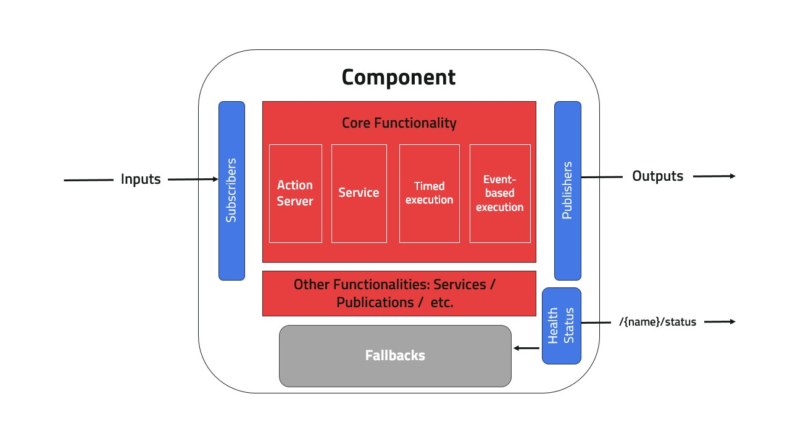
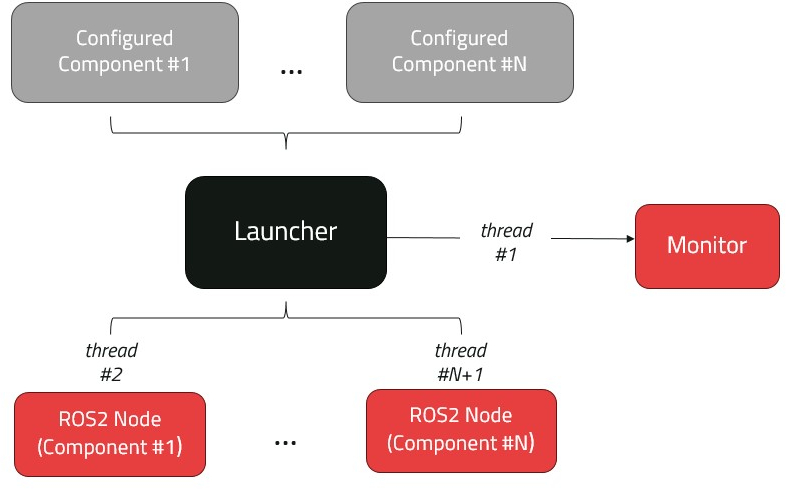
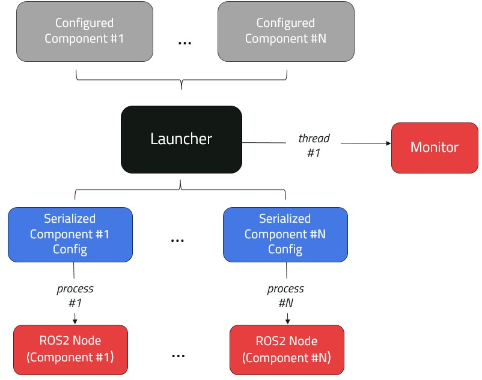

<picture>
  <source media="(prefers-color-scheme: dark)" srcset="docs/_static/ROS_SUGAR.png">
  <source media="(prefers-color-scheme: light)" srcset="docs/_static/ROS_SUGAR_DARK.png">
  
</picture>


ROS SUGAR 🍬 provides a whole lot of syntactic sugar for creating multinode ROS2 event-driven systems and management using an intitutive Python API.

- Learn more about the [**design concepts**](design/index.md) in ROS Sugar 📚
- Learn how to [**create your own ROS2 package**](use.md) using ROS Sugar 🚀

> [!NOTE]
> This is an alpha release of ROS Sugar. Breaking changes are to be expected.

## Packages created using ROS Sugar

- [**Kompass**](https://automatikarobotics.com/kompass/): a framework for building robust and comprehensive event-driven navigation stacks using an easy-to-use and intuitive Python API
- [**ROS Agents**](https://automatika-robotics.github.io/ros-agents/): a fully-loaded framework for creating interactive embodied agents that can understand, remember, and act upon contextual information from their environment.

## Overview

A [Component](./design/component.md) is the main execution unit, each component is configured with [Inputs/Outputs](./design/topics.md) and [Fallback](./design/fallbacks.md) behaviors. Additionally, each component updates its own [Health Status](./design/status.md). Components can be handled and reconfigured dynamically at runtime using [Events](./design/events.md) and [Actions](./design/actions.md). Events, Actions and Components are passed to the [Launcher](./design/launcher.md) which runs the set of components as using multi-threaded or multi-process execution. The Launcher also uses an internal [Monitor](./design/monitor.md) to keep track of the components and monitor events.











## Building from source

- ``` mkdir -p ros-sugar-ws/src```
- ``` cd ros-sugar-ws/src```
- ``` git clone https://github.com/automatika-robotics/ros-sugar```
- ``` cd ..```
- ``` colcon build --symlink-install```

## Copyright

The code in this distribution is Copyright (c) 2024 Automatika Robotics unless explicitly indicated otherwise.

ROS Sugar is made available under the MIT license. Details can be found in the [LICENSE](LICENSE) file.

## Contributions

ROS Agents has been developed in collaboration betweeen [Automatika Robotics](https://automatikarobotics.com/) and [Inria](https://inria.fr/). Contributions from the community are most welcome.
