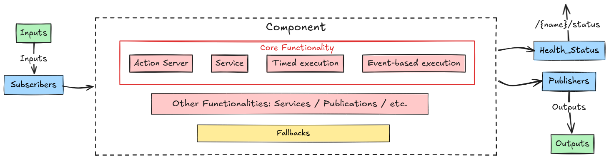
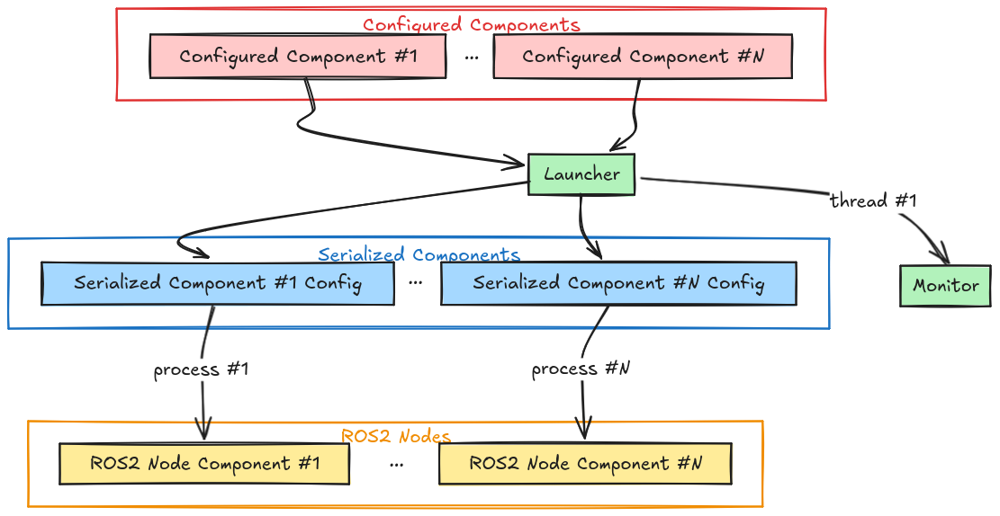

<picture>
  <source media="(prefers-color-scheme: dark)" srcset="docs/_static/ROS_SUGAR.png">
  <source media="(prefers-color-scheme: light)" srcset="docs/_static/ROS_SUGAR_DARK.png">
  
</picture>

ROS SUGAR 🍬 is a meta-framework that provides a whole lot of syntactic sugar for creating event-driven multinode systems in ROS2, using an intuitive Python API.

- Learn more about the [**design concepts**](https://automatika-robotics.github.io/ros-sugar/design/index.html) in ROS Sugar 📚
- Learn how to [**create your own ROS2 package**](https://automatika-robotics.github.io/ros-sugar/use.html) using ROS Sugar 🚀

## Packages created using ROS Sugar

- [**Kompass**](https://automatikarobotics.com/kompass/): a framework for building robust and comprehensive event-driven navigation stacks using an easy-to-use and intuitive Python API
- [**ROS Agents**](https://automatika-robotics.github.io/ros-agents/): a fully-loaded framework for creating interactive embodied agents that can understand, remember, and act upon contextual information from their environment.

## Overview

ROS Sugar is built for ROS2 developers who want to create event-driven systems with multiple nodes that are easy to use, have builtin fallbacks and fault tolerance, and can be configured started with an intuitive Python API. It provides primitives for writing ROS nodes, and events/actions which can start/stop/modify the nodes, in the spirit of event driven software. ROS Sugar is also a replacement for the ROS Launch API.

A [Component](https://automatika-robotics.github.io/ros-sugar/design/component.html) is the main execution unit in ROS Sugar, each component is configured with [Inputs/Outputs](https://automatika-robotics.github.io/ros-sugar/design/topics.md) and [Fallback](https://automatika-robotics.github.io/ros-sugar/design/fallbacks.html) behaviors. Additionally, each component updates its own [Health Status](https://automatika-robotics.github.io/ros-sugar/design/status.html). Components can be handled and reconfigured dynamically at runtime using [Events](https://automatika-robotics.github.io/ros-sugar/design/events.html) and [Actions](https://automatika-robotics.github.io/ros-sugar/design/actions.html). Events, Actions and Components are passed to the [Launcher](https://automatika-robotics.github.io/ros-sugar/design/launcher.html) which runs the set of components as using multi-threaded or multi-process execution. The Launcher also uses an internal [Monitor](https://automatika-robotics.github.io/ros-sugar/design/monitor.html) to keep track of the components and monitor events.

## Base Component

<p align="center">
<picture align="center">
  <source media="(prefers-color-scheme: dark)" srcset="docs/_static/images/diagrams/component_dark.png">
  <source media="(prefers-color-scheme: light)" srcset="docs/_static/images/diagrams/component_light.png">
  
</picture>
</p>

## Multi-Process Execution

<p align="center">
<picture>
  <source media="(prefers-color-scheme: dark)" srcset="docs/_static/images/diagrams/multi_process_dark.png">
  <source media="(prefers-color-scheme: light)" srcset="docs/_static/images/diagrams/multi_process_light.png">
  
</picture>
</p>

## Installation

Install python dependencies using pip as follows:

`pip install 'attrs>=23.2.0' msgpack-numpy numpy-quaternion setproctitle`

Grab your favorite deb package from the [release page](https://github.com/automatika-robotics/ros-sugar/releases) and install it as follows:

`sudo dpkg -i ros-$ROS_DISTRO-sugar_$version$DISTRO_$ARCHITECTURE.deb`

## Building from source

```shell
mkdir -p ros-sugar-ws/src
cd ros-sugar-ws/src
git clone https://github.com/automatika-robotics/ros-sugar && cd ..
pip install numpy opencv-python-headless 'attrs>=23.2.0' jinja2 msgpack msgpack-numpy numpy-quaternion setproctitle
colcon build
source install/setup.bash
```

## Copyright

The code in this distribution is Copyright (c) 2024 Automatika Robotics unless explicitly indicated otherwise.

ROS Sugar is made available under the MIT license. Details can be found in the [LICENSE](LICENSE) file.

## Contributions

ROS Agents has been developed in collaboration between [Automatika Robotics](https://automatikarobotics.com/) and [Inria](https://inria.fr/). Contributions from the community are most welcome.
