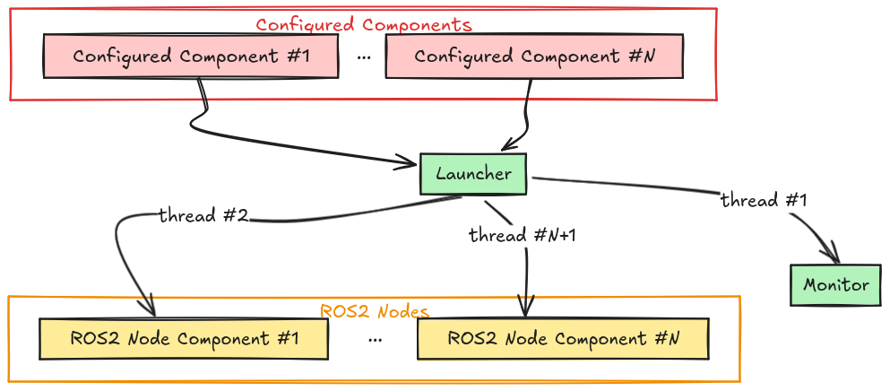
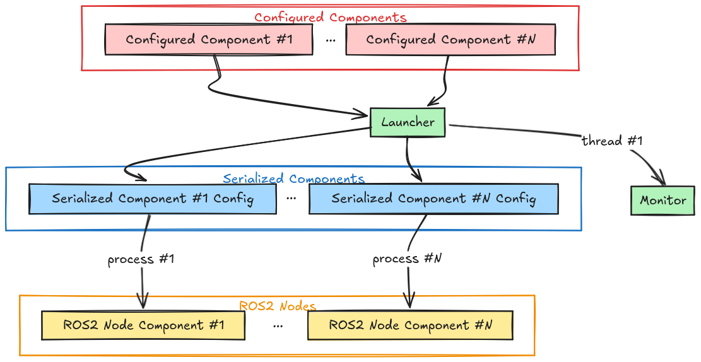

# Launcher

[Launcher](../apidocs/ros_sugar/ros_sugar.launch.launcher.md) is a class created to provide a more pythonic way to launch and configure ROS2 nodes.

Launcher starts a pre-configured component or a set of components as ROS2 nodes using multi-threaded or multi-process execution. Launcher spawns an internal [Monitor](./monitor.md) node in a separate thread in both execution types.

:::{figure-md} fig-multi-thread



Multi-threaded execution
:::

:::{figure-md} fig-multi-process



Multi-process execution
:::

Launcher can also manage a set of Events-Actions through its internal Monitor node (See Monitor class).

## Available options:
When initializing the Launcher, you can:
- Provide a ROS2 namespace to all the components
- Provide a YAML config file.
- Enable/Disable events monitoring


You can add components to the launcher by using '[add_pkg](../apidocs/ros_sugar/ros_sugar.launch.launcher.md/#classes)' method to pass any number of components from the same ROS2 package created using ROS Sugar primitives. When adding components from a new package you can configure:

- Enable/Disable multi-processing, if disabled the components are launched in threads
- Select to activate one, many or all components on start (lifecycle nodes activation)
- Set of Events/Actions related to the components

Launcher forwards all the provided Events to its internal Monitor, when the Monitor detects an Event trigger it emits an InternalEvent back to the Launcher. Execution of the Action is done directly by the Launcher or a request is forwarded to the Monitor depending on the selected run method (multi-processes or multi-threaded).

:::{note} While Launcher supports executing standard [ROS2 launch actions](https://github.com/ros2/launch). Launcher does not support standard [ROS2 launch events](https://github.com/ros2/launch/tree/rolling/launch/launch/events) for the current version.
:::

## Usage Example

```{code-block} python
:caption: launcher test
:linenos:

from ros_sugar.core import BaseComponent
from ros_sugar.actions import LogInfo
from ros_sugar.events import OnLess
from ros_sugar import Launcher

# Create your components
my_component = BaseComponent(component_name='test_component')


# Create your events
low_battery = OnLess(
    "low_battery",
    Topic(name="/battery_level", msg_type="Int"),
    15,
    ("data")
)

# Events/Actions
my_events_actions: Dict[event.Event, Action] = {
    low_battery: LogInfo(msg="Battery is Low!)
}

# We can add a config YAML file
path_to_yaml = 'my_config.yaml'

launcher = Launcher(
    config_file=path_to_yaml,
    activate_all_components_on_start=True,
    multiprocessing=True,
)

# If any component fails -> restart it with unlimited retries
launcher.on_component_fail(action_name="restart")

# Bring up the system
launcher.bringup(ros_log_level="info", introspect=False)
```
